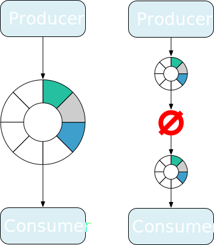

# Zemni: A distributed in-memory messaging service

## Overview

Zemni is a distributed in-memory messaging service. It provides thread-safe FIFO queue which unifies
in-process and network communication.

## Features

## Limitations

* A queue can only bind one producer node and one consumer node.
